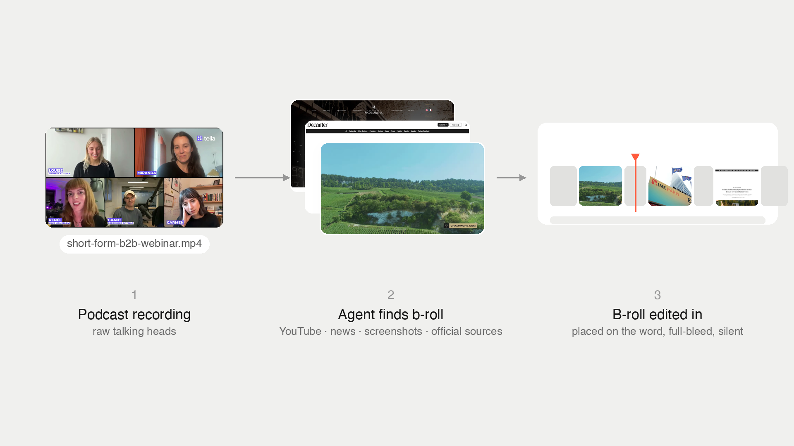

# 🎬 B-Roll Finder



**An agent skill that sources accurate, on-brand b-roll for talking-head video — and places each cutaway on the exact word.**

It reads your transcript, figures out what each line is *actually* about, routes every moment to the right kind of footage, and hands back a tight set of vetted candidates (you make the final pick). No keyword-matching, no random stock, no padding.

---

## ✅ What to use it for

It's built for **reference-rich talking-head video**, where the speaker names concrete things or makes verifiable claims. That's where b-roll has a *correct* answer the agent can nail.

**Best use cases:**

- **🎙️ Podcast & interview intros** — "In today's episode I'm joined by *[guest]*, founder of *[company]*…" Every name, company, role, and credential becomes a precise cutaway: the guest's face, their product UI, a receipt proving the claim.
- **📚 Tutorial & explainer intros** — "Today we're using *[tool]* to do *[thing]*." Product UIs, concept motion-graphics, and stat cards that make the setup land.
- **Competitor / drama videos** — receipt-heavy (tweets, headlines, reviews).
- **Storytelling / listicles** — people, products, historical moments, text cards.

**Where it shines:** the more proper nouns and provable claims a script has, the better. *Name it or prove it → great. Feel it → it defers to you.*

**Not for:** pure vibe/mood montages or non-verbal (music-only) videos — there b-roll is a taste call, and this skill hands the wheel back to you.

---

## 📥 Install

It's an **agent skill** — a methodology file your AI coding agent (e.g. [Claude Code](https://claude.com/claude-code)) reads and follows. There's no package to `npm install`; you register the skill and install the CLI tools it drives.

**1. Clone the repo**
```bash
git clone https://github.com/louisedesadeleer/b-roll-finder.git
```

**2. Register it with your agent.** For Claude Code, add a pointer in your `CLAUDE.md` (or drop `SKILL.md` in your skills directory):
```markdown
#### /find-broll
Read: /path/to/b-roll-finder/SKILL.md
Source b-roll for a video edit — classify each moment, scope the search, return vetted candidates, place on the word.
```

**3. Install the tooling it drives** (macOS / Homebrew shown):
```bash
brew install yt-dlp ffmpeg imagemagick           # search/download, compositing, contact sheets
uv tool install mlx-whisper                       # GPU word-level transcription (Apple Silicon)
#   …or: pip install -U openai-whisper            # CPU fallback
npm create video@latest                           # Remotion, for concept motion-graphics (optional)
```
A Chrome/Chromium install is also used for headless screenshots of public pages. No API keys required.

**4. (Optional) make the taste yours.** The skill ships with a working taste profile — [TASTE.md](TASTE.md) — so it sources well from the first run. When you're ready, fork it: import your YouTube subscriptions, prune, and reveal your own fingerprint from your published videos (the file walks you through it).

---

## 👅 It ships with taste

Sourcing is only half the job — the other half is **curation**, and that's where most b-roll automation falls flat. So this skill ships with a real taste profile, [TASTE.md](TASTE.md), instead of starting you from a blank interview:

- **A revealed fingerprint** — extracted from actual published videos by scene-cut analysis (not from a questionnaire): which b-roll types get used and how often, real pacing numbers (~26–28 cuts/min, median shot under 2s, sub-second "receipt montages"), and coverage ranges per video style.
- **A curated, topic-tagged source list** — the channels searches are scoped to, with a note on *why* each one earns b-roll (deadpan reaction gold ≠ credibility flex ≠ concept explainer). A tech video never gets scoped to someone's surf vlogs.
- **Opinionated guardrails** — always-silent clips, sub-pixel-only stills motion, no random open search.

It also encodes the insight that makes agent-sourced b-roll trustworthy at all: good fast-cut video leans on **objective** b-roll (receipts, official entity clips, your own graphics) — where there's a checkably *correct* answer — and almost never on vibe-picked creator clips. The profile keeps the agent in that lane.

Use it as-is, or fork it — TASTE.md ends with the three-step "make it yours" recipe (import-then-prune your subscriptions, reveal your fingerprint from your own videos, set your guardrails).

---

## ▶️ How to use it

Invoke the skill and hand it your video. It runs a **plan-first** loop — it asks a couple of setup questions, proposes a plan, and **waits for your go before sourcing anything.**

```
you:  /find-broll
      here's my podcast intro — <transcript or /path/to/intro.mp4>

it:   • asks: format/style? cadence? motion-graphics? any guests + handles?
      • proposes an annotated plan — per-beat interpretation + b-roll type + palette mix
you:  approve / cut / swap / add
it:   • sources a scored contact sheet of vetted candidates
you:  pick the ones you like
it:   • (optional) cuts them full-bleed + silent and places each on the word
```

**What to give it:**
- A **transcript** (paste it), **or** a **video/audio file path** (it transcribes with word-level timestamps), **or** a project from your editor.
- Any **must-includes**, and **guest names/handles** for interviews.

### What kind of video works best

- **Reference-rich talking-head** — a **podcast/interview intro** or a **tutorial/explainer intro** where the speaker names concrete things (people, products, companies, events) or makes verifiable claims. The more proper nouns and provable claims, the better the results.
- **Short is ideal** (under ~10 min). For long videos, it scores and selects the high-value segments first instead of blanketing the whole runtime.
- **Skip it for** pure vibe/mood or music-only video — there b-roll is a taste call it hands back to you.

---

## ⚙️ How it works

```
transcript ─► interpret each beat ─► classify & route ─► source candidates ─► you pick ─► place on the word
```

1. **Understand the topic first.** It reads the *whole* transcript and states the thesis before sourcing anything. B-roll illustrates the **point**, not the nearest keyword. (A line like *"Zaria from Duolingo made their social pop off"* is about *the person and the account she built* — not the Duolingo logo.)
2. **Per-beat interpretation.** For every candidate moment it writes one sentence — *"what is this line actually about?"* — then sources *that*. If nothing accurately illustrates the real point, it **drops the beat**. No b-roll beats wrong b-roll.
3. **Classify & route.** Each moment goes to the source that has the *correct* answer for it (see the routing table below).
4. **Scope the search.** YouTube searches stay inside trusted/official sources — official channels for entities, authoritative sources for concepts — never random open-search.
5. **Score every candidate** on recency-fit, source authority, relevance, recognizability, and format-fit. Stale or off-topic candidates are dropped before you ever see them.
6. **Contact sheet → you pick.** It narrows the funnel and presents vetted candidates. **The agent never makes the final taste call — you do.**
7. **Place it precisely.** Picked clips are cut full-bleed and silent, then dropped on the exact spoken word (anchored with word-level timestamps, landing just *after* the word — never before). Adjacent cutaways are connected — no split-second face flashes between them.
8. **Verify its own render.** After placing, it extracts a frame at every beat's midpoint and every joint, tiles them into a grid, and *looks* — catching wrong shots, burned-in captions, and stray overlays before you ever see the video. Every edit keeps a **b-roll manifest** so approved beats never silently disappear between versions.

**Cadence:** front-loaded by default — a dense, punchy hook, then sparse and precise through the body. Accuracy over volume, always.

---

## 🎨 What kind of b-roll it sources

It deliberately **mixes the palette** — never leans on website screenshots for everything:

| Type | When | Example |
|---|---|---|
| **Faces (video)** | A named person is introduced | A live interview clip of the guest talking (never a frozen headshot) |
| **Product / UI** | A tool or company is named | The actual app UI / a real screen-recording of the product |
| **Receipts** | Something happening *now* — news, claims, drama, "people are saying" | Tweets, article headlines, reviews, search results — captured as clean screenshots |
| **Reference screenshots** | A specific thing is cited | The real post, essay, or page being referenced (not a synthetic card) |
| **Concept motion-graphics** | An abstract idea, process, or stat with no literal footage | Custom on-brand animations (e.g. via Remotion) — voice-agent waveforms, growth charts, "$300M+" stat cards |
| **Real / evocative footage** | A story, action, place, or mood | Stock that *conveys* the point (bakery, paperwork, an airport) — checked for watermarks and AI-slop |
| **Historical / products** | A historical moment or physical product | Canonical archival footage; clean product shots |
| **Memes / reactions** | A punchline or reaction beat | Curated from your own library (never auto-picked) |

---

## 🧭 The routing model

Every moment is split by **what decides the right clip**:

| Route | Trigger | Source |
|---|---|---|
| **Receipts** | Time-sensitive — drama, news, complaints, a current claim | Tweets / headlines / reviews, recency-sorted |
| **Entity** | A person, a physical product, or a historical moment | Official / authoritative channel (the canonical clip) |
| **Concept** | An abstract idea you'd have to *draw* | Custom motion-graphics — or real footage from the authoritative source |
| **Cultural / Meme** | A creator clip or joke where *taste* decides | Your own library / exemplars — surfaced for you to pick, never blind-picked |

**Litmus:** *Happening now?* → Receipts. *A person / product / event?* → Entity (official source). *An abstract idea?* → Concept (motion-graphics). *A reaction beat?* → Meme (your library).

---

## 🛠️ Under the hood

- **Transcription & timing:** GPU Whisper with word-level timestamps — anchors land +0.2–0.5s after the keyword (biased late: late reads as intentional, early reads as a mistake).
- **Search & download:** `yt-dlp` (no API key) for YouTube; headless browser for public-page screenshots (with consent-wall handling via CDP — it clicks "accept" in every frame context and visually verifies each capture).
- **Motion-graphics:** Remotion, rendered full-bleed and silent in your brand style.
- **Stills motion:** a very subtle Ken Burns zoom on static images by default — rendered **sub-pixel** (float-precision Lanczos per frame), never ffmpeg `zoompan` (integer-stepped = shaky). Opt out to fully static at onboarding.
- **Compositing:** `ffmpeg` — full-bleed cover-crop (never letterboxed), blurred-fill for partial-frame subjects, no agent-built split-screens, audio stripped from every clip. Optional small source-credit label bottom-right (off/white/black/auto).

---

## 📐 Principles it follows

- **The agent never picks the final b-roll — you do.** Its job is to narrow the funnel to vetted candidates.
- **Accuracy over volume.** Fewer, perfectly-accurate beats beat lots of mediocre ones. Drop a beat before padding it.
- **Full-bleed, always.** Every clip fills the frame edge-to-edge — never tiny, never letterboxed.
- **Land on the word, never before.** B-roll that appears before the word is said reads as a mistake.
- **Mix the palette.** If a plan is >60% website screenshots, it's wrong.
- **Skip is the last resort.** Every beat gets the full palette walked before it's allowed to stay empty.
- **Once a beat is agreed, sourcing it is the agent's job.** A seven-step escalation ladder (local artifacts → identity hunt → yt-dlp → browser cookies → headless CDP → logged-in browser) runs before anything is handed back to you.
- **Approved b-roll never silently disappears.** The manifest is read before every re-render.

---

## License

MIT — see [LICENSE](LICENSE).
